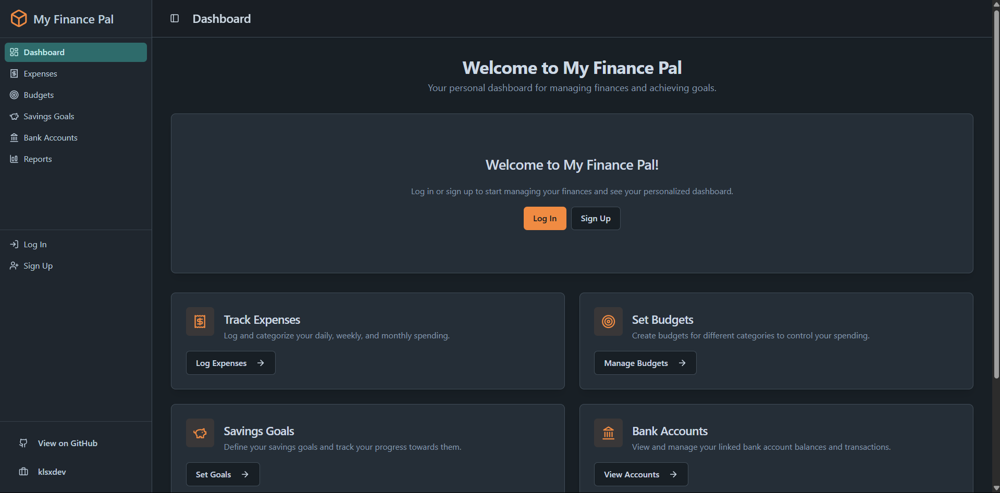

# My Finance Pal

My Finance Pal is a modern, responsive personal finance management application designed to help you take control of your financial life. 

This project is built with a modern tech stack including Next.js, TypeScript, Firebase, and Tailwind CSS, making it a robust and scalable solution for personal finance tracking.

## ✨ Key Features

- **📊 Interactive Dashboard**: Get an at-a-glance financial snapshot for the current month, including total income, total expenses, and a visual breakdown of your spending by category.
- **💸 Expense & Income Tracking**: Easily log your transactions, categorize them, add descriptions, and link them to specific bank accounts.
- **🎯 Budget Management**: Set monthly spending limits for different categories to prevent overspending. Progress bars provide a clear visual of how you're tracking against your budget.
- **🐖 Savings Goals**: Define your financial goals and track your progress towards achieving them.
- **🏦 Bank Account Management**: Add and manage multiple bank accounts to see how transactions affect your balances over time.
- **🔐 Secure Authentication**: Full user authentication system supporting Email/Password and Google Sign-In, powered by Firebase Authentication.
- **👤 Guest Mode**: Try the app without creating an account. All data is stored in your browser's local storage, giving you a full-featured experience instantly.
- **🔄 Data Backup & Restore**: Backup your application data to a local file. For guest users, this includes all financial data, which can be restored to any browser.
- **📱 Responsive Design**: A clean, modern UI built Tailwind CSS that looks and works great on any device, from desktops to mobile phones.

## 🚀 Getting Started

To get a local copy up and running, follow these simple steps.

### Prerequisites

- Node.js (v18 or later)
- npm or yarn

### Installation

1.  **Clone the repository**
    ```sh
    git clone https://github.com/your-username/my-finance-pal.git
    cd my-finance-pal
    ```

2.  **Install NPM packages**
    ```sh
    npm install
    ```

3.  **Set up Firebase**
    - Create a new project on the [Firebase Console](https://console.firebase.google.com/).
    - Go to **Project Settings** > **General** and find your web app's Firebase configuration object.
    - Enable **Firestore Database**, **Authentication** (with Email/Password and Google providers), and **Storage**.

4.  **Set up Environment Variables**
    - Create a `.env.local` file in the root of your project by copying the example file:
      ```sh
      cp .env.example .env.local
      ```
    - Open `.env.local` and fill in the values with your Firebase project's configuration keys.

5.  **Run the Development Server**
    ```sh
    npm run dev
    ```
    Open [http://localhost:9002](http://localhost:9002) with your browser to see the result.


